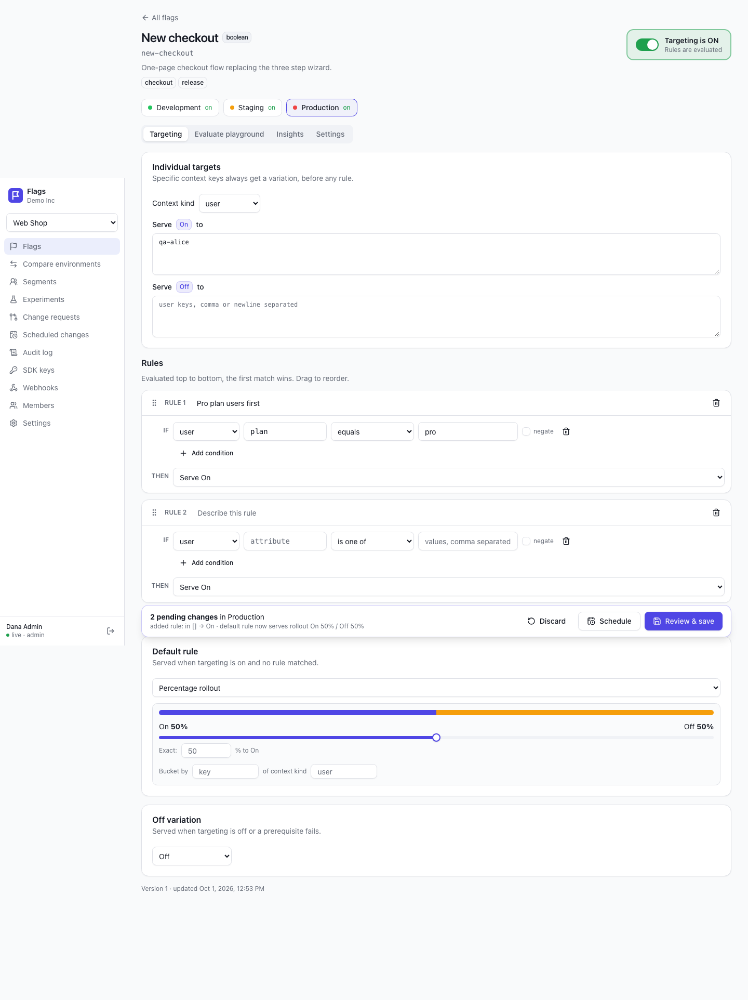
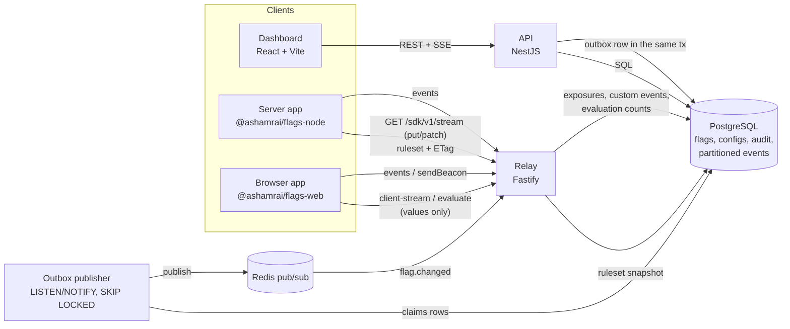

# Feature Flags Platform

A LaunchDarkly-lite for product teams: feature flags, percentage rollouts, targeting, remote config and experiments, with SDKs for Node.js, the browser, React and OpenFeature.

[](packages/evaluator)
[](packages/sdk-node)
[](LICENSE)



**Live demo:** not deployed yet (see [Getting started](#getting-started) to run it locally; demo login `demo@demo.dev` / `demo1234`) · **Video:** not recorded yet

## Why this project

Feature flags look like an `if` statement, but doing them well is a distributed systems and library design problem: the same user has to land in the same bucket on every server and in every browser, updates have to arrive in under a second without breaking the app when the network does, and experiment results have to be statistically honest. The main product here is the SDKs, built and checked like packages that other people install.

## Highlights

- **Deterministic, cross-platform bucketing** (murmurhash3 over UTF-8 bytes, per-flag salt) verified by **185 shared conformance vectors** that run against the evaluator in Node, Chromium and WebKit, the Node SDK, the browser SDK and the relay. Expected buckets come from an independent C implementation, not from the code under test.
- **Local evaluation in 0.07–0.4 µs with 0 network calls**; changes are streamed over SSE and reach SDKs **~2 ms after the commit** (p99 < 30 ms with 1000 subscribers).
- **The browser SDK never receives targeting rules**, only values evaluated for its own context (privacy by design, asserted in tests). It is **3.4 KB gzip**.
- **SDKs never break the app**: resilience tests cover a relay that is down at startup, dies mid-stream, sends a broken stream, is slow or answers `429`; the SDK serves defaults or last known values, honours `Retry-After` and recovers on its own.
- **No lost updates**: change notifications are written to a **transactional outbox** in the same transaction as the change and relayed to Redis with `LISTEN/NOTIFY` + `FOR UPDATE SKIP LOCKED`; an integration test kills the publisher process between commit and publish and still sees the patch ~0.2 s after restart.
- **Rate-limited public relay**: token buckets per IP and per SDK key, per-key event quotas and invalid-key throttling, `429` with `Retry-After`.
- **Semantic patch with optimistic versioning**: edits are intent-level instructions applied atomically; stale edits get `409`, protected environments require an approved **change request**, and every change lands in the **audit log with author, diff and a human-readable description**.
- **Experiments with a two-proportion z-test, Welch t-test, 95% confidence intervals, sample ratio mismatch detection** and a sample size calculator; the demo traffic generator has a built-in +8% effect on variant B and the experiment finds it.
- **OpenFeature providers** for server and web, so an application using OpenFeature can switch to this backend without code changes.

## Architecture



The API owns all writes. Every flag, segment or experiment change bumps the environment version and inserts a notification into the `change_outbox` table inside the same transaction; an outbox publisher (inside each API process, or as a separate process) is woken by `LISTEN/NOTIFY` after commit, claims rows with `FOR UPDATE SKIP LOCKED` and publishes them to Redis. Each relay instance keeps environment rulesets in memory, reloads the affected environment from one Postgres snapshot, and pushes a `patch` to its server SDK streams and re-evaluated values to its browser streams. Server SDKs evaluate locally with the shared `evaluator` package; browser SDKs get values evaluated by the relay. Exposure and custom events flow back through the relay into a day-partitioned Postgres table used for experiment results and insights.

## Tech stack

| Layer           | Technology                                                                    | Why                                                                                                                   |
| --------------- | ----------------------------------------------------------------------------- | --------------------------------------------------------------------------------------------------------------------- |
| Evaluation core | TypeScript, 0 dependencies                                                    | Runs unchanged in Node, browsers and edge runtimes; one implementation for every SDK                                  |
| Management API  | NestJS 11, `pg`, zod                                                          | Modules and guards for a multi-tenant admin API; zod schemas shared with the dashboard                                |
| Relay           | Fastify 5, ioredis                                                            | Small, fast HTTP server for thousands of long-lived SSE connections; scales horizontally; token-bucket rate limits    |
| Storage         | PostgreSQL 16                                                                 | Transactions for semantic patches, `FOR UPDATE SKIP LOCKED` for the scheduler, range partitioning for events          |
| Messaging       | Postgres transactional outbox + Redis pub/sub                                 | No notification lost between commit and publish; fan-out to every relay instance                                      |
| Dashboard       | React 19, Vite, TanStack Router + Query, shadcn/ui (Radix), dnd-kit, Recharts | Typed routes, cache invalidation from SSE, accessible primitives; lazy routes and vendor chunks under a 400 kB budget |
| SDK build       | tsup, publint, attw, size-limit                                               | Dual ESM/CJS with correct types, enforced bundle size                                                                 |
| Tests           | Vitest (incl. browser mode), fast-check, Playwright, tinybench                | Property tests for bucketing, real-browser conformance, end-to-end flows, reproducible benchmarks                     |

## Getting started

```sh
git clone https://github.com/ashamrai/feature-flags-platform && cd feature-flags-platform
docker compose up --build
```

Dashboard http://localhost:4220 (demo@demo.dev / demo1234), demo shop http://localhost:4230, API http://localhost:4200/docs, relay http://localhost:4210. Generate experiment traffic with `docker compose run --rm traffic`.

Without Docker (Node 20+, pnpm 10, Postgres 16, Redis 7):

```sh
pnpm install
pnpm build
pnpm seed            # creates database ffp, migrates, seeds demo data
pnpm dev             # api :4200, relay :4210, dashboard :4220, demo-shop :4230
pnpm traffic         # 27 000 simulated shoppers with +8% conversion on variant B
```

Use the SDK in your app:

```ts
import { init } from '@ashamrai/flags-node';

const flags = init({ sdkKey: 'srv-demo-production', baseUrl: 'http://localhost:4210' });
await flags.waitForInitialization({ timeoutMs: 3000 });
flags.boolVariation('new-checkout', { kind: 'user', key: 'user-42', plan: 'pro' }, false);
```

## Testing

| Level           | What                                                                                                                                                                                                                                                        | Command                                                     |
| --------------- | ----------------------------------------------------------------------------------------------------------------------------------------------------------------------------------------------------------------------------------------------------------- | ----------------------------------------------------------- |
| Unit + property | Evaluator (99% statement coverage), operators, semver, murmurhash vs reference vectors, monotonic rollout (100k keys), χ² uniformity (1M keys), flag independence, never-throws, statistics                                                                 | `pnpm test`                                                 |
| Conformance     | 185 vectors × evaluator (Node, Chromium, WebKit), Node SDK, browser SDK through the relay, relay server-side evaluation                                                                                                                                     | `pnpm test`, `pnpm test:browser`                            |
| Integration     | API + Postgres + Redis: semantic patch and 409, change requests, scheduled changes (exactly once with `SKIP LOCKED`), segments, SDK key rotation, webhooks with HMAC, experiments; relay: patch delivered < 500 ms after a change, ETag/304, client streams | `pnpm test:integration`                                     |
| Resilience      | Node SDK against a controllable fake relay: down at start, dies mid-stream, broken stream, slow relay, heartbeat timeout, polling with ETag, persistent store; 1M evaluations + 1000 patches heap test                                                      | `pnpm test`                                                 |
| E2E             | Playwright: create flag → 50% rollout → playground → demo shop updates without reload; change request with two users; "updated by X" banner; experiment page                                                                                                | `pnpm test:e2e`                                             |
| Smoke           | Starts API, relay, dashboard (preview build) and demo shop, runs 30 HTTP checks including the experiment detecting the +8% effect, stops everything                                                                                                         | `pnpm smoke`                                                |
| Packages        | size-limit, publint, attw, `pnpm pack` + install into a clean project (ESM and CJS)                                                                                                                                                                         | `pnpm size && pnpm publint && pnpm attw && pnpm pack:check` |

Integration tests create a throwaway database (`ffp_test_*`) and Redis key prefix per run, or use Testcontainers with `TESTCONTAINERS=1`.

## Performance

Evaluator benchmarks (`pnpm bench`, tinybench, 1 s per case). Apple M1, Node 26.7, macOS, 2026-10-01:

| Case                                        | Mean    | Target   |
| ------------------------------------------- | ------- | -------- |
| Boolean flag, off                           | 0.07 µs | < 0.3 µs |
| 5 rules × 3 clauses, match in the last rule | 0.38 µs | < 5 µs   |
| Rollout 50/50 (murmurhash3)                 | 0.23 µs | < 1 µs   |
| Segment with 1000 included keys             | 0.11 µs | < 1 µs   |
| Regex clause                                | 0.13 µs | < 3 µs   |

Relay load test (`pnpm loadtest`), same laptop, API + relay + Postgres + Redis + load generator on one machine that was also running other workloads:

| Scenario                                                      | Result                        |
| ------------------------------------------------------------- | ----------------------------- |
| Concurrent SSE connections on one relay process               | 3000 (147 MB RSS; 85 MB idle) |
| Patch delivery to 1000 subscribers after commit               | p50 9–15 ms, p99 15–26 ms     |
| Client-side evaluate (`POST /sdk/v1/evaluate`, 64 concurrent) | ~2 860 req/s, p99 50 ms       |
| Experiment results, 27 000 units, 2 metrics                   | ~1.1 s                        |

Run `pnpm bench` to reproduce the numbers; results are stored in `docs/benchmarks/`.

## Architecture Decisions

1. [murmurhash3 with a per-flag salt](docs/adr/0001-murmurhash3-with-per-flag-salt.md)
2. [Hash UTF-8 bytes](docs/adr/0002-utf8-bytes-for-hashing.md)
3. [Reasons are part of the API](docs/adr/0003-reasons-as-part-of-the-api.md)
4. [Semantic patch with If-Match versioning](docs/adr/0004-semantic-patch-with-optimistic-versioning.md)
5. [Browser SDK receives values, never rules](docs/adr/0005-client-sdk-without-rules.md)
6. [SSE instead of WebSocket](docs/adr/0006-sse-instead-of-websocket.md)
7. [Redis pub/sub after commit, relay reads Postgres](docs/adr/0007-change-propagation-via-redis-pubsub.md) (superseded by 13)
8. [Events in partitioned Postgres](docs/adr/0008-events-in-partitioned-postgres.md)
9. [Fixed-horizon statistics with SRM](docs/adr/0009-fixed-horizon-statistics-with-srm.md)
10. [Zero-dependency SDKs with an own SSE client](docs/adr/0010-own-sse-client-and-zero-dependency-sdks.md)
11. [NestJS with explicit tokens and zod](docs/adr/0011-nestjs-with-explicit-tokens-and-zod.md)
12. [Conformance vectors with an independent oracle](docs/adr/0012-conformance-vectors-with-independent-oracle.md)
13. [Transactional outbox for change notifications](docs/adr/0013-transactional-outbox-for-change-notifications.md)
14. [Relay rate limiting with token buckets](docs/adr/0014-relay-rate-limiting.md)

## Known limitations & next steps

- Segments are limited to 10 000 explicit keys. Larger lists should be stored separately and shipped as a Bloom filter to server SDKs or evaluated server-side only.
- Experiments use fixed-horizon tests; next would be sequential testing (always-valid p-values) and CUPED. Attribution is "after first exposure" without a conversion window.
- Events live in Postgres. Beyond hundreds of millions of rows per month, events should go to ClickHouse or a stream with materialized aggregates.
- Relay rate limits are per instance (in-memory token buckets); a global limit would need a shared store such as Redis.
- GitHub OAuth is implemented but only verified manually against the code path, not in automated tests; member invitations create accounts with a temporary password instead of sending an email.
- Not deployed and no video yet; the screenshots in `docs/screenshots` are from a local run.

More screenshots: [flags list](docs/screenshots/flags-list.png) · [playground](docs/screenshots/playground.png) · [experiment results](docs/screenshots/experiment-results.png) · [compare environments](docs/screenshots/compare.png) · [demo shop debug panel](docs/screenshots/demo-shop.png)
